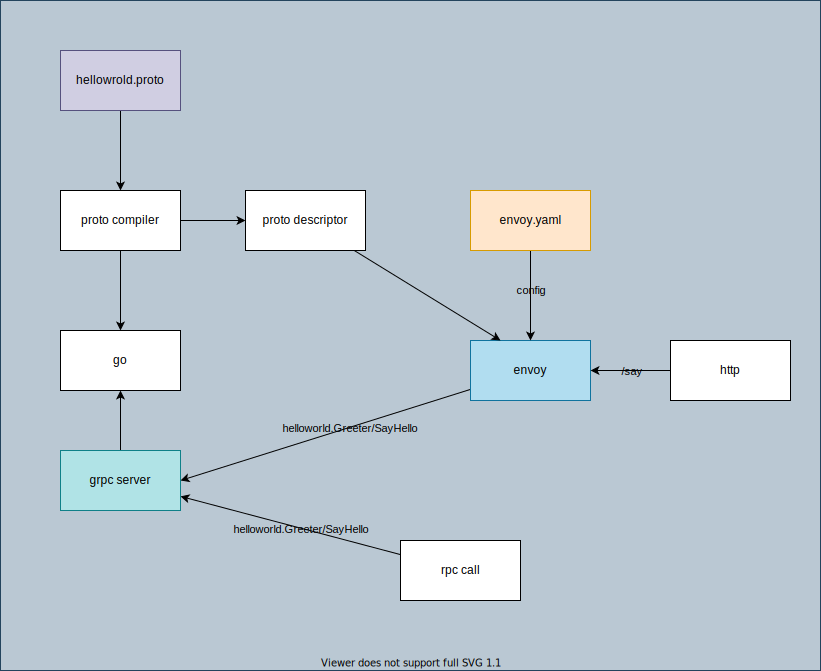

# grpc json

## Overview



## Prerequisite

1. go
    ```
    go get github.com/grpc-ecosystem/grpc-gateway/v2/protoc-gen-grpc-gateway
    go get google.golang.org/protobuf/cmd/protoc-gen-go
    go get google.golang.org/grpc/cmd/protoc-gen-go-grpc
    ```
1. protobuf
1. buf
1. envoy

## Run

```
go run maing.go
```

```
envoy -c envoy.yaml
```

## 1. Preparation: HelloWorld gRPC

1. Prepare proto.

    ```protobuf
    syntax = "proto3";

    package helloworld;

    option go_package = "github.com/nakamasato/envoy-training/grpc-json";

    // The greeting service definition.
    service Greeter {
      // Sends a greeting
      rpc SayHello(HelloRequest) returns (HelloReply) {
      }
    }

    // The request message containing the user's name.
    message HelloRequest {
      string name = 1;
    }

    // The response message containing the greetings
    message HelloReply {
      string message = 1;
    }
    ```

1. Generate go code.

    Either of the two options:

    1. With `protoc`

        ```
        protoc -I googleapis -I ./protos \
           --go_out ./protos --go_opt paths=source_relative \
           --go-grpc_out ./protos --go-grpc_opt paths=source_relative \
           ./protos/helloworld.proto
        ```

    1. With `buf`

        `protos/buf.yaml`:

        ```yaml
        version: v1
        name: buf.build/nakamasato/grpc-json
        ```

        `protos/buf.gen.yaml`:

        ```yaml
        version: v1
        plugins:
          - name: go
            out: .
            opt: paths=source_relative
          - name: go-grpc
            out: .
            opt: paths=source_relative,require_unimplemented_servers=false
        ```


        ```
        cd protos
        buf generate
        ```

    `helloworld_grpc.pb.go` and `helloworld.pb.go` will be generated.

1. Create main.go.

    ```go
    package main

    import (
        "context"
        "log"
        "net"

        "google.golang.org/grpc"

        helloworldpb "github.com/nakamasato/envoy-training/grpc-json/protos"
    )

    type server struct {
        helloworldpb.UnimplementedGreeterServer
    }

    func NewServer() *server {
        return &server{}
    }

    func (s *server) SayHello(ctx context.Context, in *helloworldpb.HelloRequest) (*helloworldpb.HelloReply, error) {
        return &helloworldpb.HelloReply{Message: in.Name + " world"}, nil
    }

    func main() {
        // Create a listener on TCP port
        lis, err := net.Listen("tcp", ":50051")
        if err != nil {
            log.Fatalln("Failed to listen:", err)
        }

        // Create a gRPC server object
        s := grpc.NewServer()
        // Attach the Greeter service to the server
        helloworldpb.RegisterGreeterServer(s, &server{})
        // Serve gRPC Server
        log.Println("Serving gRPC on 0.0.0.0:50051")
        log.Fatal(s.Serve(lis))
    }
    ```

1. Run grpc server.

    ```
    go run main.go
    ```

1. Invoke RPC with [grpcurl](https://github.com/fullstorydev/grpcurl).

    ```
    grpcurl -import-path ./protos -proto protos/helloworld.proto -plaintext localhost:50051 list
    helloworld.Greeter
    ```

    ```
    grpcurl -d '{"name": "naka"}' -import-path ./protos -proto protos/helloworld.proto -plaintext localhost:50051 helloworld.Greeter/SayHello
    {
      "message": "naka world"
    }
    ```

## 2. Enable to call grpc via HTTP request

1. Update proto file.

    1. Add `import "google/api/annotations.proto";`
    1. Add google.api.http option for route config.

        ```go
        option (google.api.http) = {
          post: "/say"
          body: "*"
        };
        ```

1. Generate transcriptor set.

    Either of the two options:

    1. With protoc (need to manually copy some dependencies.. (skip)):

        ```
        protoc -Igoogleapis -I. --include_imports --include_source_info \
        --descriptor_set_out=protos/helloworld.pb protos/helloworld.proto
        ```

    1. With buf:

        1. Add the following dependency to `buf.yaml`:

            ```yaml
            deps:
              - buf.build/googleapis/googleapis
            ```

        1. Run buf

            ```
            cd protos
            buf mod update
            buf build --as-file-descriptor-set -o helloworld.pb
            ```

    `protos/helloworld.pb` will be generated.

1. Check

    ```
    grpcurl -d '{"name": "naka"}' -protoset protos/helloworld.pb -plaintext localhost:50051 helloworld.Greeter/SayHello
    ```

1. Run envoy with envoy configuration.

    ```
    envoy -c envoy.yaml
    ```

1. Check with http request.

    ```
    curl -d '{"name": "naka"}' http://localhost:51051/say
    {
     "message": "naka world"
    }
    ```


# References
1. https://grpc-ecosystem.github.io/grpc-gateway/docs/tutorials/simple_hello_world/
1. https://github.com/grpc-ecosystem/grpc-gateway
1. https://grpc.io/docs/languages/go/
1. https://github.com/fullstorydev/grpcurl
1. https://www.envoyproxy.io/docs/envoy/latest/configuration/http/http_filters/grpc_json_transcoder_filter.html#route-configs-for-transcoded-requests
