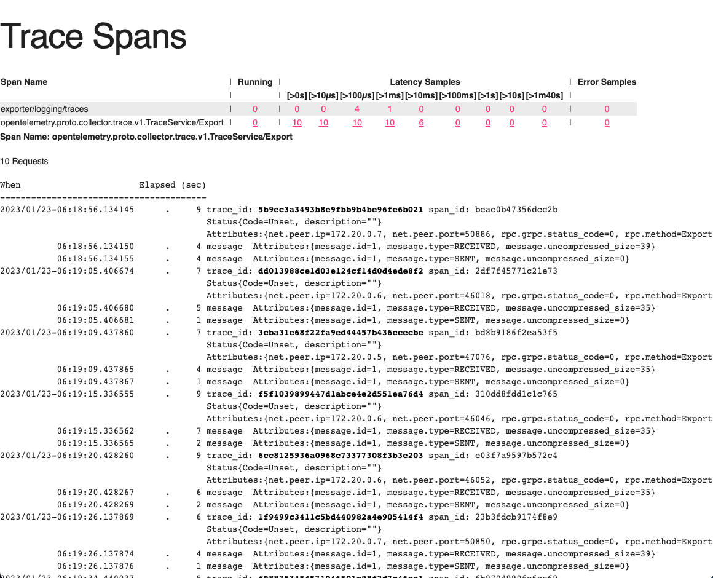

# OpenTelemetry

[Tracing](https://www.envoyproxy.io/docs/envoy/latest/intro/arch_overview/observability/tracing)
[OpenTelemetry Tracing](https://www.envoyproxy.io/docs/envoy/latest/start/sandboxes/opentelemetry)



1. `envoy-1`: This proxy listens on 2 ports:
    1. `:10000` -> `service-1`
    1. `:10001` ->  `envoy-2`
1. `envoy-2`: This proxy listens on port 10000 and routes all queries to `service-2`.
1. `envoy-front-proxy-1`: # This proxy listens on port 10000, and routes the following paths:
    1. /trace/1 -> routes to `envoy-1` on port 10000
    1. /trace/2 -> routes to `envoy-1` on port 10001 (for onward routing to `envoy-2`)
1. `opentelemetry`: opentelemetry collector with [otel-collector-config.yaml](https://github.com/envoyproxy/envoy/blob/afa41e7c40e839d89c8956ef845ee151eae70953/examples/opentelemetry/otel-collector-config.yaml): we can access the collected traces on http://localhost:55679/debug/tracez
    <details><summary>otel-collector-config.yaml</summary>

    ```yaml
    extensions:
      memory_ballast:
        size_mib: 512
      zpages:
        endpoint: 0.0.0.0:55679
      health_check:

    receivers:
      otlp:
        protocols:
          grpc:
          http:

    processors:
      batch:
      memory_limiter:
        # 75% of maximum memory up to 4G
        limit_mib: 1536
        # 25% of limit up to 2G
        spike_limit_mib: 512
        check_interval: 5s

    exporters:
      logging:
        loglevel: debug

    service:
      pipelines:
        traces:
          receivers: [otlp]
          processors: [memory_limiter, batch]
          exporters: [logging]
        metrics:
          receivers: [otlp]
          processors: [memory_limiter, batch]
          exporters: [logging]

      extensions: [memory_ballast, zpages, health_check]
    ```

    </details>
1. `service-1`: Simple flask app that returns "Hello from behind Envoy (service <SERVICE_NAME>)!" with path `trace/<SERVICE_NAME>`

    <details><summary>config/service.py</summary>

    ```python
    import os

    from flask import Flask
    from flask.helpers import send_from_directory

    app = Flask(__name__)


    @app.route(f"/trace/{os.environ['SERVICE_NAME']}")
    def get_service():
        return f"Hello from behind Envoy (service {os.environ['SERVICE_NAME']})!\n"


    if __name__ == "__main__":
        app.run(host='0.0.0.0', port=8080)
    ```

    </details>

1. `service-2`: Simple flask app (same as service-1)

## Configuration

```yaml
          tracing:
            provider:
              name: envoy.tracers.opentelemetry
              typed_config:
                "@type": type.googleapis.com/envoy.config.trace.v3.OpenTelemetryConfig
                grpc_service:
                  envoy_grpc:
                    cluster_name: opentelemetry_collector
                  timeout: 0.250s
                service_name: front-envoy
```

1. `grpc_service`: (config.core.v3.GrpcService) The upstream gRPC cluster that will receive OTLP traces.
1. `service_name`: (string) The name for the service. This will be populated in the ResourceSpan Resource attributes.

https://www.envoyproxy.io/docs/envoy/latest/api-v3/config/trace/v3/opentelemetry.proto.html

## Steps

1. clone submodule

    ```
    git submodule update --init
    ```
1. Run the apps
    ```
    docker-compose -f envoy/examples/opentelemetry/docker-compose.yaml up
    ```

    This will start the 6 containers listed above. You can see all the configuration files under [opentelemetry](https://github.com/envoyproxy/envoy/blob/afa41e7c40e839d89c8956ef845ee151eae70953/examples/opentelemetry)

1. Send requests

    ```
    curl localhost:10000/trace/1
    Hello from behind Envoy (service 1)!
    ```

    ```
    curl localhost:10000/trace/2
    Hello from behind Envoy (service 2)!
    ```

    <details><summary>Log:</summary>

    You can see the three spans for the same trace id: `b154731ff888619f540c2774bdb1f58f`

    1. `Request ID generation`: <- Envoy generated request id
        ```
        guid:x-request-id: STRING(15d4060c-ecba-9b75-b491-c8e3d5f5d91c)
        ```
    1. `Client trace ID joining`: The `x-client-trace-id` header can be used to join untrusted request IDs to the trusted internal x-request-id. (Currently no `x-client-trace-id`)

    1. External trace service integration

    ```
    opentelemetry-service-2-1          | 172.20.0.5 - - [23/Jan/2023 06:42:51] "GET /trace/2 HTTP/1.1" 200 -
    opentelemetry-opentelemetry-1      | 2023-01-23T06:42:52.230Z   info    TracesExporter  {"kind": "exporter", "data_type": "traces", "name": "logging", "#spans": 1}
    opentelemetry-opentelemetry-1      | 2023-01-23T06:42:52.233Z   info    ResourceSpans #0
    opentelemetry-opentelemetry-1      | Resource SchemaURL:
    opentelemetry-opentelemetry-1      | Resource labels:
    opentelemetry-opentelemetry-1      |      -> service.name: STRING(front-envoy)
    opentelemetry-opentelemetry-1      | ScopeSpans #0
    opentelemetry-opentelemetry-1      | ScopeSpans SchemaURL:
    opentelemetry-opentelemetry-1      | InstrumentationScope
    opentelemetry-opentelemetry-1      | Span #0
    opentelemetry-opentelemetry-1      |     Trace ID       : b154731ff888619f540c2774bdb1f58f
    opentelemetry-opentelemetry-1      |     Parent ID      :
    opentelemetry-opentelemetry-1      |     ID             : b9ca55d6f3e02868
    opentelemetry-opentelemetry-1      |     Name           : egress localhost:10000
    opentelemetry-opentelemetry-1      |     Kind           : SPAN_KIND_CLIENT
    opentelemetry-opentelemetry-1      |     Start time     : 2023-01-23 06:42:51.32042 +0000 UTC
    opentelemetry-opentelemetry-1      |     End time       : 2023-01-23 06:42:51.356216 +0000 UTC
    opentelemetry-opentelemetry-1      |     Status code    : STATUS_CODE_UNSET
    opentelemetry-opentelemetry-1      |     Status message :
    opentelemetry-opentelemetry-1      | Attributes:
    opentelemetry-opentelemetry-1      |      -> node_id: STRING()
    opentelemetry-opentelemetry-1      |      -> zone: STRING()
    opentelemetry-opentelemetry-1      |      -> guid:x-request-id: STRING(15d4060c-ecba-9b75-b491-c8e3d5f5d91c)
    opentelemetry-opentelemetry-1      |      -> http.url: STRING(http://localhost:10000/trace/2)
    opentelemetry-opentelemetry-1      |      -> http.method: STRING(GET)
    opentelemetry-opentelemetry-1      |      -> downstream_cluster: STRING(-)
    opentelemetry-opentelemetry-1      |      -> user_agent: STRING(curl/7.79.1)
    opentelemetry-opentelemetry-1      |      -> http.protocol: STRING(HTTP/1.1)
    opentelemetry-opentelemetry-1      |      -> peer.address: STRING(172.20.0.1)
    opentelemetry-opentelemetry-1      |      -> request_size: STRING(0)
    opentelemetry-opentelemetry-1      |      -> response_size: STRING(37)
    opentelemetry-opentelemetry-1      |      -> component: STRING(proxy)
    opentelemetry-opentelemetry-1      |      -> upstream_cluster: STRING(envoy_cluster2)
    opentelemetry-opentelemetry-1      |      -> upstream_cluster.name: STRING(envoy_cluster2)
    opentelemetry-opentelemetry-1      |      -> http.status_code: STRING(200)
    opentelemetry-opentelemetry-1      |      -> response_flags: STRING(-)
    opentelemetry-opentelemetry-1      |    {"kind": "exporter", "data_type": "traces", "name": "logging"}
    opentelemetry-opentelemetry-1      | 2023-01-23T06:42:55.447Z   info    TracesExporter  {"kind": "exporter", "data_type": "traces", "name": "logging", "#spans": 1}
    opentelemetry-opentelemetry-1      | 2023-01-23T06:42:55.447Z   info    ResourceSpans #0
    opentelemetry-opentelemetry-1      | Resource SchemaURL:
    opentelemetry-opentelemetry-1      | Resource labels:
    opentelemetry-opentelemetry-1      |      -> service.name: STRING(envoy-2)
    opentelemetry-opentelemetry-1      | ScopeSpans #0
    opentelemetry-opentelemetry-1      | ScopeSpans SchemaURL:
    opentelemetry-opentelemetry-1      | InstrumentationScope
    opentelemetry-opentelemetry-1      | Span #0
    opentelemetry-opentelemetry-1      |     Trace ID       : b154731ff888619f540c2774bdb1f58f
    opentelemetry-opentelemetry-1      |     Parent ID      : 67089ea6a2565b65
    opentelemetry-opentelemetry-1      |     ID             : d8483f8c9c9b9eb3
    opentelemetry-opentelemetry-1      |     Name           : ingress
    opentelemetry-opentelemetry-1      |     Kind           : SPAN_KIND_SERVER
    opentelemetry-opentelemetry-1      |     Start time     : 2023-01-23 06:42:51.334526 +0000 UTC
    opentelemetry-opentelemetry-1      |     End time       : 2023-01-23 06:42:51.354205 +0000 UTC
    opentelemetry-opentelemetry-1      |     Status code    : STATUS_CODE_UNSET
    opentelemetry-opentelemetry-1      |     Status message :
    opentelemetry-opentelemetry-1      | Attributes:
    opentelemetry-opentelemetry-1      |      -> node_id: STRING()
    opentelemetry-opentelemetry-1      |      -> zone: STRING()
    opentelemetry-opentelemetry-1      |      -> guid:x-request-id: STRING(15d4060c-ecba-9b75-b491-c8e3d5f5d91c)
    opentelemetry-opentelemetry-1      |      -> http.url: STRING(http://localhost:10000/trace/2)
    opentelemetry-opentelemetry-1      |      -> http.method: STRING(GET)
    opentelemetry-opentelemetry-1      |      -> downstream_cluster: STRING(-)
    opentelemetry-opentelemetry-1      |      -> user_agent: STRING(curl/7.79.1)
    opentelemetry-opentelemetry-1      |      -> http.protocol: STRING(HTTP/1.1)
    opentelemetry-opentelemetry-1      |      -> peer.address: STRING(172.20.0.6)
    opentelemetry-opentelemetry-1      |      -> request_size: STRING(0)
    opentelemetry-opentelemetry-1      |      -> response_size: STRING(37)
    opentelemetry-opentelemetry-1      |      -> component: STRING(proxy)
    opentelemetry-opentelemetry-1      |      -> upstream_cluster: STRING(service_cluster2)
    opentelemetry-opentelemetry-1      |      -> upstream_cluster.name: STRING(service_cluster2)
    opentelemetry-opentelemetry-1      |      -> http.status_code: STRING(200)
    opentelemetry-opentelemetry-1      |      -> response_flags: STRING(-)
    opentelemetry-opentelemetry-1      |    {"kind": "exporter", "data_type": "traces", "name": "logging"}
    opentelemetry-opentelemetry-1      | 2023-01-23T06:42:56.050Z   info    TracesExporter  {"kind": "exporter", "data_type": "traces", "name": "logging", "#spans": 1}
    opentelemetry-opentelemetry-1      | 2023-01-23T06:42:56.050Z   info    ResourceSpans #0
    opentelemetry-opentelemetry-1      | Resource SchemaURL:
    opentelemetry-opentelemetry-1      | Resource labels:
    opentelemetry-opentelemetry-1      |      -> service.name: STRING(envoy-1)
    opentelemetry-opentelemetry-1      | ScopeSpans #0
    opentelemetry-opentelemetry-1      | ScopeSpans SchemaURL:
    opentelemetry-opentelemetry-1      | InstrumentationScope
    opentelemetry-opentelemetry-1      | Span #0
    opentelemetry-opentelemetry-1      |     Trace ID       : b154731ff888619f540c2774bdb1f58f
    opentelemetry-opentelemetry-1      |     Parent ID      : b9ca55d6f3e02868
    opentelemetry-opentelemetry-1      |     ID             : 67089ea6a2565b65
    opentelemetry-opentelemetry-1      |     Name           : egress localhost:10000
    opentelemetry-opentelemetry-1      |     Kind           : SPAN_KIND_CLIENT
    opentelemetry-opentelemetry-1      |     Start time     : 2023-01-23 06:42:51.331208 +0000 UTC
    opentelemetry-opentelemetry-1      |     End time       : 2023-01-23 06:42:51.35539 +0000 UTC
    opentelemetry-opentelemetry-1      |     Status code    : STATUS_CODE_UNSET
    opentelemetry-opentelemetry-1      |     Status message :
    opentelemetry-opentelemetry-1      | Attributes:
    opentelemetry-opentelemetry-1      |      -> node_id: STRING()
    opentelemetry-opentelemetry-1      |      -> zone: STRING()
    opentelemetry-opentelemetry-1      |      -> guid:x-request-id: STRING(15d4060c-ecba-9b75-b491-c8e3d5f5d91c)
    opentelemetry-opentelemetry-1      |      -> http.url: STRING(http://localhost:10000/trace/2)
    opentelemetry-opentelemetry-1      |      -> http.method: STRING(GET)
    opentelemetry-opentelemetry-1      |      -> downstream_cluster: STRING(-)
    opentelemetry-opentelemetry-1      |      -> user_agent: STRING(curl/7.79.1)
    opentelemetry-opentelemetry-1      |      -> http.protocol: STRING(HTTP/1.1)
    opentelemetry-opentelemetry-1      |      -> peer.address: STRING(172.20.0.7)
    opentelemetry-opentelemetry-1      |      -> request_size: STRING(0)
    opentelemetry-opentelemetry-1      |      -> response_size: STRING(37)
    opentelemetry-opentelemetry-1      |      -> component: STRING(proxy)
    opentelemetry-opentelemetry-1      |      -> upstream_cluster: STRING(envoy_cluster2)
    opentelemetry-opentelemetry-1      |      -> upstream_cluster.name: STRING(envoy_cluster2)
    opentelemetry-opentelemetry-1      |      -> http.status_code: STRING(200)
    opentelemetry-opentelemetry-1      |      -> response_flags: STRING(-)
    opentelemetry-opentelemetry-1      |    {"kind": "exporter", "data_type": "traces", "name": "logging"}
    ```

    </details>

1. View traces on http://localhost:55679/debug/tracez
    


https://opentelemetry-python-contrib.readthedocs.io/en/latest/instrumentation/flask/flask.html
